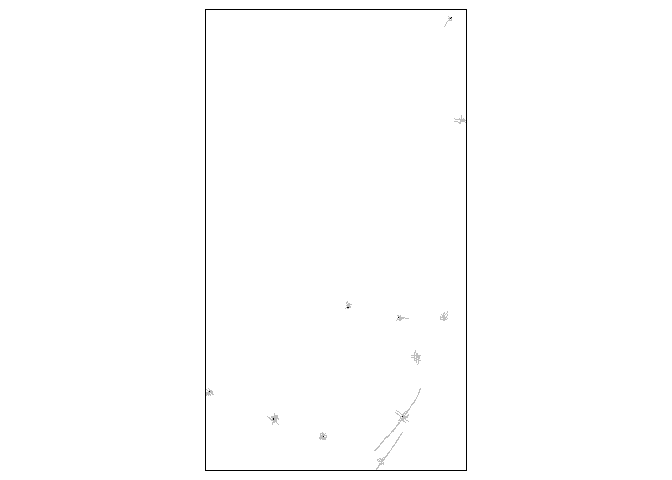
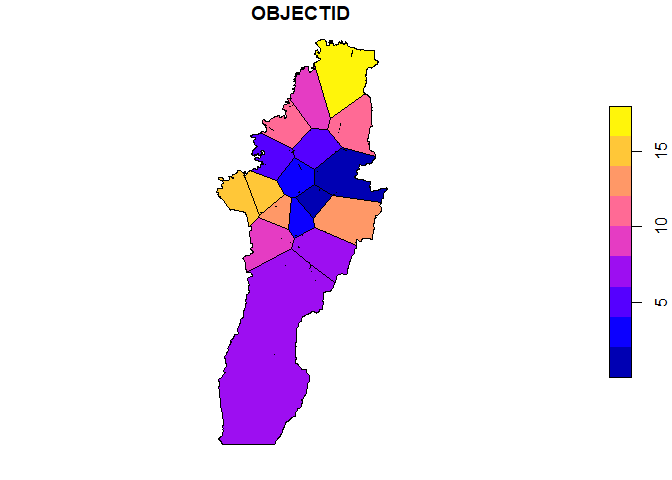
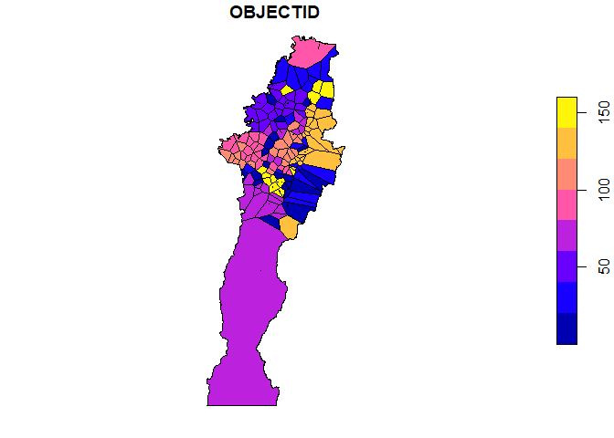

# Isochrone generation for Emergency Services in Bogota


## Libraries

``` r
library(sf)
library(tidyverse)
library(opentripplanner)
library(tmap)
```

## Loading the data

All the files containing spatial data are loaded and then re-projected
to the CRS for Colombia. These files have been obtained from the [open
data portal for Bogota](https://datosabiertos.bogota.gov.co/).

``` r
areas_bomberos <- st_read("00_data/jurisdicciones/Jurisdicciones.shp") |>
  st_transform(9377)
```

    Reading layer `Jurisdicciones' from data source 
      `C:\Users\ts18jpf\OneDrive - University of Leeds\02_MsC\10_GEOG5870M_WebGIS\FireStationsBogota\Analysis\00_data\jurisdicciones\Jurisdicciones.shp' 
      using driver `ESRI Shapefile'
    Simple feature collection with 17 features and 7 fields
    Geometry type: MULTIPOLYGON
    Dimension:     XY
    Bounding box:  xmin: 58642.27 ymin: 4293.245 xmax: 110101.8 ymax: 126611.5
    Projected CRS: MAGNA_Ciudad_Bogota

``` r
estaciones_bomberos <- st_read("00_data/ebom.gpkg") |>
  st_transform(9377)
```

    Reading layer `EBom' from data source 
      `C:\Users\ts18jpf\OneDrive - University of Leeds\02_MsC\10_GEOG5870M_WebGIS\FireStationsBogota\Analysis\00_data\ebom.gpkg' 
      using driver `GPKG'
    Simple feature collection with 17 features and 5 fields
    Geometry type: POINT
    Dimension:     XY
    Bounding box:  xmin: -74.18605 ymin: 4.512008 xmax: -74.04071 ymax: 4.749962
    Geodetic CRS:  MAGNA-SIRGAS

``` r
cais <- st_read("00_data/comandoatencioninmediata.gpkg") |>
  st_transform(9377) |>
  rowid_to_column("OBJECTID")
```

    Reading layer `ComandoAtencionInmediata' from data source 
      `C:\Users\ts18jpf\OneDrive - University of Leeds\02_MsC\10_GEOG5870M_WebGIS\FireStationsBogota\Analysis\00_data\comandoatencioninmediata.gpkg' 
      using driver `GPKG'
    Simple feature collection with 153 features and 28 fields
    Geometry type: POINT
    Dimension:     XY
    Bounding box:  xmin: -74.20627 ymin: 4.471904 xmax: -74.02257 ymax: 4.796298
    Geodetic CRS:  MAGNA-SIRGAS

### Extracting Station IDs and codes

The following code extracts the station code and id to be used in the
web app.

``` r
IDs_fire <- estaciones_bomberos |>
  st_drop_geometry() |> 
  mutate(EST_CODE = str_extract(EBONOMBRE,"B-\\s*\\d{1,2}") |> 
           str_remove_all("\\s*")) |> 
  select(OBJECTID,EST_CODE)
```

## Snapping points to the road network

Point layers represent the location of the police and fire stations;
however, in some cases, they might not be *connected* to the actual road
network. So, it might be necessary to snap the points to the road
network to avoid problems when producing the iso-chrones. OpenStreetMap
road network was extracted using the [BBBike
service](https://extract.bbbike.org/).

``` r
st_layers("OTP/graphs/default/planet_-74.248_4.559_6e1729ca.osm.pbf")
```

    Driver: OSM 
    Available layers:
            layer_name       geometry_type features fields crs_name
    1           points               Point       NA     10   WGS 84
    2            lines         Line String       NA     10   WGS 84
    3 multilinestrings   Multi Line String       NA      4   WGS 84
    4    multipolygons       Multi Polygon       NA     25   WGS 84
    5  other_relations Geometry Collection       NA      4   WGS 84

``` r
# A vector with the linestrings that can be used by motorised vehicles
road_types <- c("tertiary",
                "residential",
                "primary_link",
                "secondary_link",
                "primary",
                "secondary",
                "trunk",
                "trunk_link",
                "service",
                "unclassified",
                "tertiary_link")

# Loading the data
road_network <- st_read("OTP/graphs/default/planet_-74.248_4.559_6e1729ca.osm.pbf",
                        layer = "lines") |>
  filter(highway %in% road_types) |> 
  st_transform(st_crs(estaciones_bomberos))
```

    Reading layer `lines' from data source 
      `C:\Users\ts18jpf\OneDrive - University of Leeds\02_MsC\10_GEOG5870M_WebGIS\FireStationsBogota\Analysis\OTP\graphs\default\planet_-74.248_4.559_6e1729ca.osm.pbf' 
      using driver `OSM'
    Simple feature collection with 133207 features and 10 fields
    Geometry type: LINESTRING
    Dimension:     XY
    Bounding box:  xmin: -74.25308 ymin: 4.427091 xmax: -73.98715 ymax: 4.83091
    Geodetic CRS:  WGS 84

Snapping the points using the `st_snap` function from the `sf` package

``` r
est_bomberos_snapped <- estaciones_bomberos |>
  st_snap(road_network,tolerance = 50)
cai_snapped <- cais |> 
  st_snap(road_network,tolerance = 50)
```

``` r
## Alternative snapping for points with using st_nearest_points function
# cai_nearest <- cais |> st_nearest_feature(road_network)
# cai_snapped_point <- cais |> 
#   st_nearest_points(road_network[cai_nearest,],pairwise = T) |>
#   st_cast("MULTIPOINT") |>
#   st_as_sf() |>
#   rowid_to_column("OBJECTID") |>
#   st_cast("POINT") |>
#   slice_tail(n=1, by = "OBJECTID") |> 
#   bind_cols(cais |> st_drop_geometry())
```

## Reprojecting the data to Pseudo-mercator

In order to use the OTP routing engine, the spatial objects need to use
`WG84 (EPSG: 4326)` as the coordinate reference system.

``` r
est_bomberos_4326_original <- estaciones_bomberos |>
  st_transform(4326) 
cais_4326_original <- cais |>
  st_transform(4326)

est_bomberos_4326 <- est_bomberos_snapped |>
  st_transform(4326) 
cais_4326 <- cai_snapped |>
  st_transform(4326)

fire_jurisdiction_4326 <- areas_bomberos |>
  st_transform(4326)
```

## Setting-up and initialising the routing service

Isochrones are generated using the OpenTripPlanner routing engine. The
`opentripplanner` package is used for building the graph from the OSM
network and producing the isochrones. Standard routing parameters are
used for this analysis i.e. speeds for motorised traffic are constant
depending on the link type and not related to the traffic levels. Speed
for cars is assumed to be 34 km/h based on the data reported by the
Secretariat for Mobility in Bogota
[here](https://transport.aws-ec2-us-east-1.opendatasoft.com/pages/trafico/?flg=es-es)

``` r
path_data <- file.path("OTP")
# dir.create(path_data)
path_otp <- otp_dl_jar(path_data, cache = TRUE)
```

``` r
# This is necessary only once
router_config <- otp_make_config("router")
router_config$routingDefaults$carSpeed <- 23/3.6
otp_validate_config(router_config)
otp_write_config(router_config,                # Save the config file
                 dir = path_data,
                 router = "default")

log1 <- otp_build_graph(otp = path_otp, dir = path_data,memory = 15000)
```

Running the OTPserver

``` r
log2 <- otp_setup(otp = path_otp, dir = path_data)
```

The time zone is set to Bogota, although this does not have any impact
on the results.

``` r
otpcon <- otp_connect(timezone = "America/Bogota")
```

Producing isochrones for Fire-stations

``` r
isochrones_fire <- lapply(seq_len(nrow(est_bomberos_4326_original)),
                          function(i){
                            otp_isochrone(otpcon,
                            fromPlace = est_bomberos_4326_original[i,], 
                            mode = "CAR",
                            ncores = 10,
                            cutoffSec = seq(30,1200,30))|>
  mutate(OBJECTID = est_bomberos_4326$OBJECTID[i])
                            })
```

Producing isochrones for Immediate Attention Command CAI

``` r
isochrones_cais <- lapply(seq_len(nrow(cais_4326_original)),
                          function(i){
                            try(
                              otp_isochrone(otpcon,
                            fromPlace = cais_4326_original[i,], 
                            mode = "CAR",
                            ncores = 10,
                            maxWalkDistance = 200,
                            cutoffSec = seq(30,1200,30)) |>
  mutate(OBJECTID = cais_4326$OBJECTID[i])
  )
                            })
```

Exploring the location of points with no isochrones

``` r
no_iso_fire <- vapply(isochrones_fire,nrow,numeric(1))==0
no_iso_cais <- vapply(isochrones_cais,nrow,numeric(1))==0

# Number of points with no cais
sum(no_iso_fire)
```

    [1] 0

``` r
sum(no_iso_cais)
```

    [1] 11

A map to show the points with no isochrones

``` r
buffer_cai <- cais_4326[no_iso_cais,] |>
  st_buffer(150) |>
  st_transform(9377)

tmap_mode("plot")
tm_shape(cai_snapped[no_iso_cais,])+
  tm_dots()+
  tm_shape(road_network[buffer_cai,])+
  tm_lines("gray")
```



Attempt using the original location

``` r
cais_4326_alternative <- cais_4326[no_iso_cais,]
```

``` r
isochrones_cais_2 <- lapply(seq_len(nrow(cais_4326_alternative)),
                          function(i){
                            try(
                              otp_isochrone(otpcon,
                            fromPlace = cais_4326_alternative[i,], 
                            mode = c("WALK","CAR"),
                            ncores = 10,
                            maxWalkDistance = 200,
                            cutoffSec = seq(30,1200,30)) |>
  mutate(OBJECTID = cais_4326_alternative$OBJECTID[i])
  )
                            })
```

Check of the new isochrones:

``` r
no_iso_cais2 <- vapply(isochrones_cais_2,nrow,numeric(1))==0
sum(no_iso_cais2)
```

    [1] 0

## Consolidating isochrones

``` r
iso_fire_sf <- do.call(rbind,isochrones_fire)

iso_police_sf <- rbind(do.call(rbind,isochrones_cais[!no_iso_cais]),
                       do.call(rbind,isochrones_cais_2))
```

``` r
iso_fire_sf_comp <- bind_rows(iso_fire_sf,
                          iso_fire_sf |>
                            group_by(id, time) |>
                            summarise(geometry = st_union(geometry)) |>
                            mutate(OBJECTID = 0) |> 
                            ungroup())
```

## Producing Voronoi polygons for all stations

Taken from
[gis.stackexchange.com](https://gis.stackexchange.com/questions/362134/i-want-to-create-a-voronoi-diagram-while-retaining-the-data-in-the-data-frame%22)

``` r
st_voronoi_point <- function(points){
    ## points must be POINT geometry
    # check for point geometry and execute if true
    if(!all(st_geometry_type(points) == "POINT")){
        stop("Input not  POINT geometries")
    }
    g = st_combine(st_geometry(points)) # make multipoint
    v = st_voronoi(g)
    v = st_collection_extract(v)
    return(v[unlist(st_intersects(points, v))])
}


voronoi_fire = st_voronoi_point(estaciones_bomberos)
voronoi_fire_attr = st_set_geometry(estaciones_bomberos, voronoi_fire) |>
  st_transform(4326) |>
  st_intersection(fire_jurisdiction_4326 |> st_union())

voronoi_police = st_voronoi_point(cais)
voronoi_police_attr = st_set_geometry(cais,
                                      voronoi_police) |>
  st_transform(4326) |>
  st_intersection(fire_jurisdiction_4326 |> st_union())

plot(voronoi_fire_attr[,1])
```



``` r
plot(voronoi_police_attr[,1])
```



### Incidents

Incidents attended by the fire stations

``` r
# Load all the incidents CAIS and FIREstations
fire_incitends_files <- list.files("00_data/incidentes",pattern = "\\.shp$",
                                   ignore.case = T,
                                   full.names = T)

fires_raw <- lapply(fire_incitends_files,st_read)
```

    Reading layer `Incidentes_2023' from data source 
      `C:\Users\ts18jpf\OneDrive - University of Leeds\02_MsC\10_GEOG5870M_WebGIS\FireStationsBogota\Analysis\00_data\incidentes\Incidentes_2023.shp' 
      using driver `ESRI Shapefile'
    Simple feature collection with 31097 features and 15 fields
    Geometry type: POINT
    Dimension:     XYZ
    Bounding box:  xmin: -1.797693e+308 ymin: -1.797693e+308 xmax: 122876.7 ymax: 279823.9
    z_range:       zmin: -1.797693e+308 zmax: 0
    Projected CRS: MAGNA_Ciudad_Bogota
    Reading layer `Incidentes_V_2021' from data source 
      `C:\Users\ts18jpf\OneDrive - University of Leeds\02_MsC\10_GEOG5870M_WebGIS\FireStationsBogota\Analysis\00_data\incidentes\Incidentes_V_2021.shp' 
      using driver `ESRI Shapefile'
    Simple feature collection with 25597 features and 16 fields
    Geometry type: POINT
    Dimension:     XY
    Bounding box:  xmin: -1.797693e+308 ymin: -1.797693e+308 xmax: 111180.8 ymax: 125786.3
    Projected CRS: MAGNA_Ciudad_Bogota
    Reading layer `Incidentes_V2019' from data source 
      `C:\Users\ts18jpf\OneDrive - University of Leeds\02_MsC\10_GEOG5870M_WebGIS\FireStationsBogota\Analysis\00_data\incidentes\Incidentes_V2019.shp' 
      using driver `ESRI Shapefile'
    Simple feature collection with 11314 features and 16 fields
    Geometry type: POINT
    Dimension:     XY
    Bounding box:  xmin: -1.797693e+308 ymin: -1.797693e+308 xmax: 107480.9 ymax: 134548.3
    Projected CRS: MAGNA_Ciudad_Bogota
    Reading layer `Incidentes_V2020' from data source 
      `C:\Users\ts18jpf\OneDrive - University of Leeds\02_MsC\10_GEOG5870M_WebGIS\FireStationsBogota\Analysis\00_data\incidentes\Incidentes_V2020.shp' 
      using driver `ESRI Shapefile'
    Simple feature collection with 23481 features and 16 fields
    Geometry type: POINT
    Dimension:     XY
    Bounding box:  xmin: -1.797693e+308 ymin: -1.797693e+308 xmax: 110245.5 ymax: 126481.5
    Projected CRS: MAGNA_Ciudad_Bogota
    Reading layer `Incidentes_VF2022' from data source 
      `C:\Users\ts18jpf\OneDrive - University of Leeds\02_MsC\10_GEOG5870M_WebGIS\FireStationsBogota\Analysis\00_data\incidentes\Incidentes_VF2022.shp' 
      using driver `ESRI Shapefile'
    Simple feature collection with 30075 features and 15 fields
    Geometry type: POINT
    Dimension:     XY
    Bounding box:  xmin: -1.797693e+308 ymin: -1.797693e+308 xmax: 109504.7 ymax: 161714.4
    Projected CRS: MAGNA_Ciudad_Bogota

``` r
sel_cols <- Reduce(intersect,lapply(fires_raw,names))

fires_comp <- do.call(rbind,lapply(fires_raw,
                                   \(x) (x |>
                                     select(any_of(sel_cols)) |>
                                     st_transform(4326) |> 
                                     st_zm())[fire_jurisdiction_4326,]
                      )) |>
  mutate(across(FECHA, list(day = day,
                            month = month,
                            year = year))) |> 
  st_make_valid() |> 
  mutate(EST_CODE = str_extract(ESTACION,"B-\\s*\\d{1,2}") |>
           str_remove_all("\\s*")) |>
  left_join(IDs_fire,by= "EST_CODE") |> 
  drop_na(OBJECTID)
```

### Jurisdictions

``` r
fire_jurisdiction_4326_id <- fire_jurisdiction_4326 |>
  left_join(IDs_fire,by= c("ESTACION"="EST_CODE"))
```

## Saving the layers in the `GPKG` files

### Stations

``` r
st_write(est_bomberos_4326_original,
         "../data/isochrones_Fire.gpkg",
         delete_dns = T,
         delete_layer = T,
         layer = "fire_stn")
```

    Deleting layer `fire_stn' using driver `GPKG'
    Writing layer `fire_stn' to data source 
      `../data/isochrones_Fire.gpkg' using driver `GPKG'
    Writing 17 features with 5 fields and geometry type Point.

``` r
st_write(cais_4326_original,
         "../data/isochrones_Police.gpkg",
         delete_dns = T,
         delete_layer = T,
         layer = "police_stn")
```

    Deleting layer `police_stn' using driver `GPKG'
    Writing layer `police_stn' to data source 
      `../data/isochrones_Police.gpkg' using driver `GPKG'
    Writing 153 features with 29 fields and geometry type Point.

### Isochrones

``` r
st_write(iso_fire_sf_comp,
         "../data/isochrones_Fire.gpkg",
         delete_dns = T,
         delete_layer = T,
         layer = "isochrones")
```

    Deleting layer `isochrones' using driver `GPKG'
    Writing layer `isochrones' to data source 
      `../data/isochrones_Fire.gpkg' using driver `GPKG'
    Writing 600 features with 4 fields and geometry type Multi Polygon.

``` r
st_write(iso_police_sf,
         "../data/isochrones_Police.gpkg",
         delete_dns = T,
         delete_layer = T,
         layer = "isochrones")
```

    Deleting layer `isochrones' using driver `GPKG'
    Writing layer `isochrones' to data source 
      `../data/isochrones_Police.gpkg' using driver `GPKG'
    Writing 5175 features with 4 fields and geometry type Multi Polygon.

### Administrative jurisdictions

``` r
st_write(fire_jurisdiction_4326_id,
         "../data/isochrones_Fire.gpkg",
         delete_dns = T,
         delete_layer = T,
         layer = "fire_areas")
```

    Deleting layer `fire_areas' using driver `GPKG'
    Writing layer `fire_areas' to data source 
      `../data/isochrones_Fire.gpkg' using driver `GPKG'
    Writing 17 features with 8 fields and geometry type Multi Polygon.

### Incidents

``` r
st_write(fires_comp,
         "../data/isochrones_Fire.gpkg",
         delete_dns = T,
         delete_layer = T,
         layer = "fire_incidents")
```

    Deleting layer `fire_incidents' using driver `GPKG'
    Writing layer `fire_incidents' to data source 
      `../data/isochrones_Fire.gpkg' using driver `GPKG'
    Writing 115569 features with 20 fields and geometry type Point.

### Voronoi catchment

``` r
st_write(voronoi_fire_attr,
         "../data/isochrones_Fire.gpkg",
         delete_dns = T,
         delete_layer = T,
         layer = "voronoi_fire")
```

    Deleting layer `voronoi_fire' using driver `GPKG'
    Writing layer `voronoi_fire' to data source 
      `../data/isochrones_Fire.gpkg' using driver `GPKG'
    Writing 17 features with 5 fields and geometry type Multi Polygon.

``` r
st_write(voronoi_police_attr,
         "../data/isochrones_Police.gpkg",
         delete_dns = T,
         delete_layer = T,
         layer = "voronoi_police")
```

    Deleting layer `voronoi_police' using driver `GPKG'
    Writing layer `voronoi_police' to data source 
      `../data/isochrones_Police.gpkg' using driver `GPKG'
    Writing 153 features with 29 fields and geometry type Multi Polygon.

Stopping the server

``` r
otp_stop()
```
